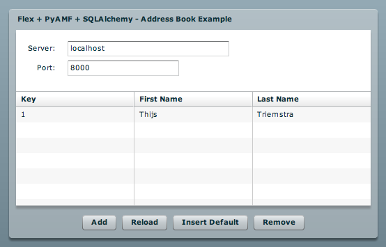

***************
  Addressbook
***************

.. topic:: Introduction

   This page describes how to setup the Addressbook example application
   using the `Flex SDK`_ and SQLAlchemy_.

   This example demonstrates loading and saving persistent objects with
   lazy-loaded values.

   Check the :doc:`SQLAlchemy Adapter<../gateways/sqlalchemy>` page for
   more info on using SQLAlchemy with PyAMF.

A live demo can be found on the PyAMF blog_.

Download
========

Grab the example from SVN with:

.. code-block:: bash

    svn export http://svn.pyamf.org/pyamf/trunk/doc/tutorials/examples/actionscript/addressbook addressbook-example
    cd addressbook-example/python

Alternatively, if you just want to have a look, you can browse_ the example online.

Gateway
=======

**Note**: make sure you have SQLAlchemy_ >= 0.96 installed.

The remoting gateway for the Adobe Flash Player and Python AMF clients starts on
http://localhost:8000 when you launch the `development server`_:

.. code-block:: bash

    python server.py

You should see something like:

.. code-block:: bash

    Running SQLAlchemy AMF gateway on http://localhost:8000
    Press Ctrl-c to stop server.

Options
-------

When you run `python server.py --help` it will display the various options available
for this example server:

.. code-block:: bash

    Usage: server.py [options]

    Options:
      -h, --help            show this help message and exit
      -p PORT, --port=PORT  port number [default: 8000]
      --host=HOST           host address [default: localhost]

Clients
=======

Flash Player
------------

You can simply open the `SWF file`_ and it will connect to http://localhost:8000.

.. _Flex SDK: http://opensource.adobe.com/wiki/display/flexsdk/Flex+SDK
.. _SQLAlchemy: http://sqlalchemy.org
.. _blog: http://blog.pyamf.org/archives/sqlalchemy-and-flash-addressbook-example
.. _browse: http://pyamf.org/browser/pyamf/trunk/doc/tutorials/examples/actionscript/addressbook
.. _development server: http://pyamf.org/browser/pyamf/trunk/doc/tutorials/examples/actionscript/addressbook/python/server.py
.. _SWF file: http://pyamf.org/browser/pyamf/trunk/doc/tutorials/examples/actionscript/addressbook/flex/deploy/sa_example.swf
