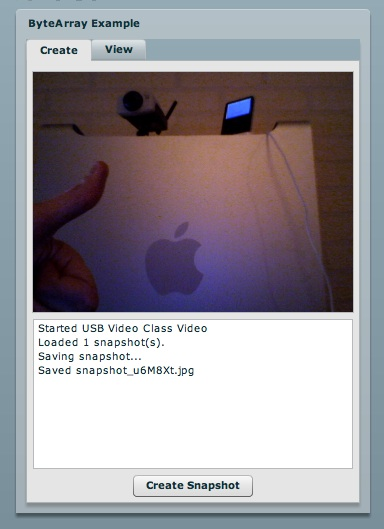

*************
  ByteArray
*************

.. topic:: Introduction

   This page describes how to setup the `ByteArray` example application
   using the `Flex SDK`_ and :doc:`Django <../gateways/django>`.

   The `ByteArray` class in Actionscript 3.0 provides methods and
   properties to optimize reading, writing, and working with binary
   data used in the Adobe Flash Player 9 and newer.

This example demonstrates how to:

- Create a webcam snapshot by capturing the `BitmapData` using Flex
- Wrap the image data with the `ByteArray` class and send it to a PyAMF
  remoting gateway
- Use Python_ to write the JPG file to disk
- Run a simple webserver for static content that serves the JPG files
- Use Flex to load the JPG and display it in the application

A live demo can be found on the PyAMF blog_.

Download
========
Grab the example from SVN with:

.. code-block:: bash

    svn export http://svn.pyamf.org/pyamf/trunk/doc/tutorials/examples/actionscript/bytearray bytearray-example
    cd bytearray-example/python

Alternatively, if you just want to have a look, you can browse_ the example online.

Gateway
=======

**Note**: make sure you have Django_ >= 0.96 installed.

The remoting gateway for the Adobe Flash Player and Python AMF clients starts on
http://127.0.0.1:8000 when you launch the `development server`_:

.. code-block:: bash

    python manage.py runserver

You should see something like:

.. code-block:: bash

    Validating models...
    0 errors found

    Django version 0.97-pre-SVN-7510, using settings 'python.settings'
    Development server is running at http://127.0.0.1:8000/
    Quit the server with CONTROL-C.

You can start the development server on a different host/port like this:

.. code-block:: bash

    python manage.py runserver 192.168.1.100:8080

Client
======

You can simply open the `SWF file`_ and it will connect to http://localhost:8000.

Press the 'Create snapshot' button to make snapshots and save them to disk. You
can see the snapshots in the View tab. The snapshots are saved in the
`python/gateway/images` folder.

.. _Flex SDK: http://opensource.adobe.com/wiki/display/flexsdk/Flex+SDK
.. _Django: http://djangoproject.com
.. _Python: http://python.org
.. _blog: http://blog.pyamf.org/archives/bytearray-example
.. _browse: http://pyamf.org/browser/pyamf/trunk/doc/tutorials/examples/actionscript/bytearray
.. _development server: http://pyamf.org/browser/pyamf/trunk/doc/tutorials/examples/actionscript/bytearray/python/manage.py
.. _SWF file: http://pyamf.org/browser/pyamf/trunk/doc/tutorials/examples/actionscript/bytearray/flex/deploy/bytearray.swf

