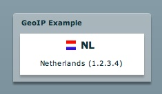

*********
  GeoIP
*********

.. topic:: Introduction

   This page describes how to setup the GeoIP example application.

   This example uses the open source `GeoIP APIs`_ for looking up
   the location of an IP address. The API includes support for lookup
   of country, region, city, latitude, and longitude.

A live demo can be found on the PyAMF blog_.

Download
========
Grab the example from SVN with:

.. code-block:: bash

    svn export http://svn.pyamf.org/pyamf/trunk/doc/tutorials/examples/actionscript/geoip geoip-example
    cd geoip-example/python

Alternatively, if you just want to have a look, you can browse_ the example online.

Gateway
=======

The remoting gateway for the Adobe Flash Player and Python AMF clients starts on
http://localhost:8000 when you launch the `development server`_ from the
`python` folder:

.. code-block:: bash

    python server.py

You should see something like this:

.. code-block:: bash

    Running GeoIP AMF gateway on http://localhost:8000

Client
======

You can simply open the `SWF file`_ and it will connect to http://localhost:8000.

.. _GeoIP APIs: http://sourceforge.net/projects/geoip
.. _Python: http://python.org
.. _blog: http://blog.pyamf.org/archives/geoip-example
.. _browse: http://pyamf.org/browser/pyamf/trunk/doc/tutorials/examples/actionscript/geoip
.. _development server: http://pyamf.org/browser/pyamf/trunk/doc/tutorials/examples/actionscript/geoip/python/server.py
.. _SWF file: http://pyamf.org/browser/pyamf/trunk/doc/tutorials/examples/actionscript/geoip/flex/deploy/geoip.swf
