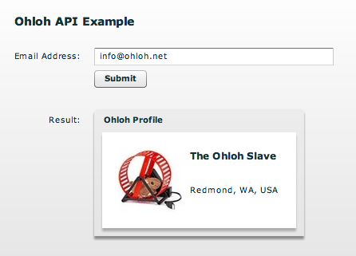

*************
  Ohloh API
*************

.. topic:: Introduction

   Ohloh_ is a website which provides a web services suite and online
   community platform that aims to map the landscape of open source
   software development. 

   The `Ohloh API`_ is a free, REST-based programming interface to the
   Ohloh open source directory. You can use the Ohloh API to create
   your own applications and web services based on Ohloh data.

There is a live demo available on the PyAMF blog_.

Download
========

Grab the example from the `Subversion repository`_ with:

.. code-block:: bash

    svn export http://svn.pyamf.org/pyamf/trunk/doc/tutorials/examples/actionscript/ohloh ohloh-example
    cd ohloh-example/python

Alternatively, if you just want to have a look at the source, you can
browse_ the example online.

Server
======

The WSGI server for the Adobe Flash Player and Python AMF clients starts on
http://localhost:8000 when you launch the `development server`_ from the `python`
folder:

.. code-block:: bash

    python server.py

**Note**: Make sure you replace the API key in ohloh.py_ with a valid one
that you can get for free when you sign up on Ohloh.

Clients
=======

Use of one the following clients to communicate with Ohloh.

- `Python client`_
- `SWF file`_

Other examples are available on the `Ohloh website`_.

.. _Ohloh: http://www.ohloh.net
.. _Ohloh API: http://www.ohloh.net/api/getting_started
.. _Subversion repository: http://svn.pyamf.org/pyamf/trunk/doc/tutorials/examples/actionscript/ohloh
.. _blog: http://blog.pyamf.org/archives/ohloh-api-and-python 
.. _browse: http://pyamf.org/browser/pyamf/trunk/doc/tutorials/examples/actionscript/ohloh
.. _ohloh.py: http://pyamf.org/browser/pyamf/trunk/doc/tutorials/examples/actionscript/ohloh/python/ohloh.py
.. _development server: http://pyamf.org/browser/pyamf/trunk/doc/tutorials/examples/actionscript/bytearray/python/manage.py
.. _SWF file: http://pyamf.org/browser/pyamf/trunk/doc/tutorials/examples/actionscript/ohloh/flex/deploy/ohloh.swf
.. _Ohloh website: http://www.ohloh.net/api/examples
.. _Python client: http://pyamf.org/browser/pyamf/trunk/doc/tutorials/examples/actionscript/ohloh/python/client.py
