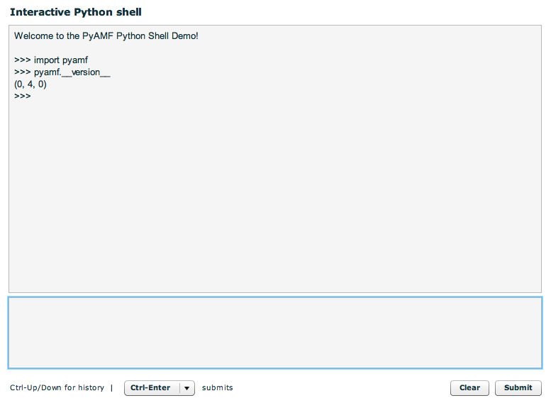

****************************
  Interactive Python Shell
****************************

.. topic:: Introduction

   This document describes how to setup the interactive, stateful Flex
   shell that runs Python code on the server using the Flex_ SDK,
   :doc:`Google App Engine<../gateways/appengine>` and
   :doc:`Django <../gateways/django>`.

We recommend you **don't** run this example on a production server because
it exposes major security risks. This example is for educational purposes ;)

A live demo can be found on the PyAMF `Google App Engine example page`_.

Download
========

Grab the example from SVN with:

.. code-block:: bash

    svn export http://svn.pyamf.org/pyamf/trunk/doc/tutorials/examples/actionscript/shell shell-example
    cd shell-example/python

Alternatively, if you just want to have a look, you can browse_ the example online.

Setup
=====

**Note**: make sure you have Django_ >= 0.96 installed.

Database
--------

This example uses SQLite_ to provide session support. First initialise the database by running:

.. code-block:: bash

    python manage.py syncdb

Should output the following:

.. code-block:: bash

    Creating table django_content_type
    Creating table django_session

Gateway
-------

The remoting gateway for the Adobe Flash Player and Python AMF clients is available on
http://localhost:8000/gateway/shell/ when you launch the `development server`_:

.. code-block:: bash

    python manage.py runserver

You should see something like:

.. code-block:: bash

    Validating models...
    0 errors found

    Django version 0.97-pre-SVN-7510, using settings 'python.settings'
    Development server is running at http://127.0.0.1:8000/
    Quit the server with CONTROL-C.

Client
======

You can simply open the `SWF file`_ and it will connect to http://localhost:8000.

.. _Flex: http://opensource.adobe.com/wiki/display/flexsdk/Flex+SDK
.. _Django: http://djangoproject.com
.. _Google App Engine example page: http://pyamf.appspot.com/shell
.. _browse: http://pyamf.org/browser/pyamf/trunk/doc/tutorials/examples/actionscript/shell
.. _development server: http://pyamf.org/browser/pyamf/trunk/doc/tutorials/examples/actionscript/shell/python/manage.py
.. _SQLite: http://sqlite.org
.. _SWF file: http://pyamf.org/browser/pyamf/trunk/doc/tutorials/examples/actionscript/shell/flex/deploy/shell.swf